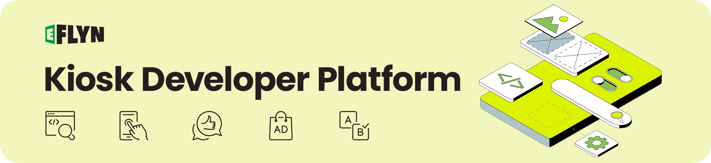
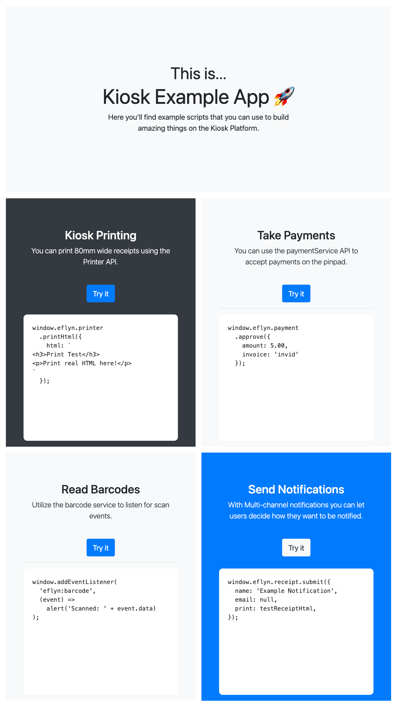

# Eflyn SDK

Welcome to the Eflyn SDK, a comprehensive JavaScript-based Software Development Kit that allows developers to access a variety of Kiosk APIs while developing applications on the Eflyn Kiosk Platform.

## Introduction

The Eflyn Kiosk Developer Platform is a powerful ecosystem that offers developers a suite of APIs, tools, and pre-built workflows to expedite the creation, testing, and deployment of kiosk applications. Our platform is dedicated to delivering an unmatched user experience, ensuring that your kiosk applications stand out in the market. 

### Key Features

- **Speedy App Development**: Leverage our robust API suite for efficient and effortless custom kiosk app creation.
- **Admin API**: Seamlessly manage kiosk hardware and applications with our fully-typed, open-source API.
- **Custom Kiosk Apps**: Utilize the E Suite Platform SDK for seamless integrations with Kiosk OS, barcode scanners, printers, and more.
- **Payment Acceptance**: Integrate in-person payments directly on the kiosk using our Payment API, compatible with popular North American payment platforms.
- **Developer Onboarding**: Benefit from comprehensive support, detailed documentation, and consultation services for a smooth onboarding experience.

## Getting Started

The SDK object is provided by calling the connectClient() method exported from the ```@eflyn/sdk``` package.

```ts

import { connectClient } from '@eflyn/sdk';

const eflyn = connectClient();
eflyn.printer.printHtml({
  html: `TEST RECEIPT $10.00`
});

```
Another option is using the [hosted sdk.js script](/sdk.js) in your HTML:

```html
<!DOCTYPE html>
<html>
    <head>
        <title>Example Kiosk App</title>
    </head>
    <body>
        <!-- Import sdj.js to access Eflyn SDK -->
        <script src="/sdk.js"></script>
        <!-- Start custom script that uses the eflyn SDK -->
        <script>
            const eflyn = connectClient();
            eflyn.printer.printHtml({
                html: `TEST RECEIPT $10.00`
            });
        </script>
    </body>
</html>
```

### How It Works
#### Server Setup
The SDK is made accessible to clients by means of the ```startServer()``` method.
Please note **this is done automatically** and is not a required step for clients using the SDK.

```ts
import { startServer } from '@eflyn/sdk';

/**
 * Here we start an SDK server by providing it a functional SDK
 * object as well as a handler for sending messages to external
 * non SDK top windows (this necessary is for inter-frame 
 * communication as described below).
 */
startServer(sdk, (message) => {
  eflynPlatform.appWindow.postMessageToAll(message);
});
```

This package is designed to work with both a window and its child iframes as well as across multiple windows.

#### Intra-frame Communication
This package uses window.postMessage to enable bi-directional communication between the SDK server and client. So long as clients in a single browser window context can access the server at window.top they will be able to communicate with the SDK, this includes any iframes and iframes within iframes that import and use ```connectClient()```.

#### Inter-frame Communication
When using multiple "top" windows (such as with Webview) typical intra-frame communication does not work and so special APIs must be written at the platform level to allow passing messages between different window.top objects.

This package provides a solution using the ```startWindowProxy()``` utility method which can enable you to fill in message passing logic to enable communication between different windows.

```ts
/**
 * webview-preload.js
 * 
 * This file is loaded into all webviews
 */

import { startWindowProxy } from '@eflyn/sdk';

/**
 * Here we use startWindowProxy from
 * the SDK and provide a mechanism for passing 
 * messages to the main window from a webview.
 */
startWindowProxy((message) => {
  sdkServerWindow.postMessage(message);
});
```


## Examples

Find example scripts below that demonstrate how to utilize the Eflyn SDK to build applications on the Kiosk Platform.

### Kiosk Printing

Print 80mm wide receipts using the Printer API:

```javascript
eflyn.printer.printHtml({
  html: `
    <h3>Print Test</h3>
    <p>Print real HTML here!</p>
  `
});
```

### Take Payments
Accept payments on the pinpad using the paymentService API:

```javascript
eflyn.payment.approve({
  amount: 5.00,
  invoice: 'invid'
});
```

### Read Barcodes
Listen for scan events with the barcode service:

```javascript
eflyn.on('eflyn.barcode.read', ({ code }) =>
  alert('Scanned: ' + code)
);
```

# Sample App 🚀
Check out the [kiosk example app here](./assets/example/index.html) that will give you a more comprehensive understanding of how web apps are setup and integrated with the Eflyn SDK.
<br><br>

<br><br>
You can also [copy the link](./assets/example/index.html) and set it up as a Custom App in your backend to get started.  
